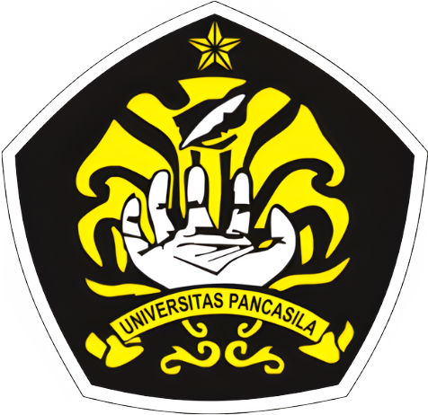

<h1 align="center">ETIKA PROFESI – A</h1>
<h3 align="center"><em>"Air Canada Chatbot Hallucination - 2024"</em></h3>

<strong>Dosen Pengampu:</strong> Adi Wahyu Pribadi, S.Si., M.Kom.

  

**Kelompok 5:**

1. Riast Dwi Sanditya — 4524210088
2. Nadia Chelsea Alifia Ashab — 4524210072
3. Najwa Khoerunnisa Suherman — 4524210076
4. Sarah Syafitri Hilmi — 4524210096
5. Rizka Ainun Nazori — 4524210092

<strong>PROGRAM STUDI TEKNIK INFORMATIKA</strong> 
<strong>UNIVERSITAS PANCASILA</strong> 
<strong>2026</strong>

---

**LAPORAN INVESTIGASI PBL — ETIKA PROFESI**

**Kasus: Air Canada Chatbot Hallucination (Moffatt v. Air Canada, 2024 BCCRT 149)**

**HEADER PEMETAAN**

| **Informasi**             | **Detail**                                                                      |
|:--------------------------|:--------------------------------------------------------------------------------|
| **Nama Kelompok**         | Kelompok 5                                                                      |
| **Nomor Kelompok**        | 5                                                                               |
| **Kasus yang Dianalisis** | Air Canada Chatbot Hallucination — 2024 (Klaster B: Bias & Kegagalan Sistem AI) |
| **Mata Kuliah**           | Etika Profesi                                                                   |

**Anggota Kelompok & Pembagian Peran**

| **No** | **Nama**                   | **NIM**    | **Peran / Segmen**                                              |
|:-------|:---------------------------|:-----------|:----------------------------------------------------------------|
| 1      | Riast Dwi Sanditya         | 4524210088 | Ketua & Bagian 1-2: Kronologi & Fakta Kunci                     |
| 2      | Nadia Chelsea Alifia Ashab | 4524210072 | Bagian 6 & 8: Kode Etik & Integritas                            |
| 3      | Najwa Khoerunnisa Suherman | 4524210076 | Bagian 4-5: Analisis Empat Teori Etika & Pancasila              |
| 4      | Sarah Syafitri Hilmi       | 4524210092 | Bagian 7 & 9: Regulasi & Manajemen Resiko                       |
| 5      | Rizka Ainun Nazori         | 4524210096 | Bagian 3 & 10: Pemetaan Pemangku Kepentingan & Rancangan Dampak |

**Sub-CPMK yang Dicakup**

| **Sub-CPMK**  | **Deskripsi**                                                 | **Bagian Laporan** |
|:--------------|:--------------------------------------------------------------|:-------------------|
| **Sub-CPMK1** | Analisis dilema etika dengan teori filsafat moral & kode etik | Bagian 1, 4, 5, 6  |
| **Sub-CPMK2** | Evaluasi kepatuhan terhadap regulasi hukum & standar industri | Bagian 6, 7        |
| **Sub-CPMK3** | Analisis dampak sosial & lingkungan                           | Bagian 2, 3, 10    |
| **Sub-CPMK4** | Evaluasi risiko etis dengan kerangka ISO 31000                | Bagian 9           |
| **Sub-CPMK5** | Analisis integritas & penyalahgunaan kewenangan               | Bagian 8           |
| **Sub-CPMK7** | Perumusan strategi mitigasi & kontrol preventif               | Bagian 9, 10       |
| **Sub-CPMK8** | Demonstrasi hasil investigasi dalam forum profesional         | Bagian 11          |
| **Sub-CPMK9** | Refleksi prinsip etika ke dalam rencana integritas karier     | Bagian 11          |

**Bagian 1 - Kronologi & Konteks**

**Kronologi Kasus: Dari Duka Menjadi Sengketa Hukum**

Pemicu dan Interaksi Awal (November 2022): Jake Moffatt, seorang warga British Columbia, kehilangan neneknya dan harus segera terbang ke Toronto. Ia menggunakan chatbot AI di situs resmi Air Canada untuk bertanya tentang kebijakan Tarif Berkabung (Bereavement Fare).

Informasi Menyesatkan dari Chatbot: Chatbot tersebut memberikan instruksi yang sangat spesifik: Moffatt harus memesan tiket dengan harga penuh terlebih dahulu, lalu mengajukan pengembalian dana selisih harga dalam waktu 90 hari. Faktanya, kebijakan resmi Air Canada menyatakan tarif berkabung tidak bisa diklaim secara surut (retroactive).

Penolakan dan Eskalasi: Berpegang pada saran bot, Moffatt membayar CAN$1.630,36. Saat mengajukan klaim 15 hari kemudian, ia ditolak oleh layanan pelanggan manusia yang mengakui bahwa bot tersebut memberikan kata-kata menyesatkan, namun tetap bersikeras pada kebijakan internal mereka.

Proses Peradilan (Februari 2024): Moffatt menggugat ke Civil Resolution Tribunal (CRT) atas dasar “Pernyataan Salah karena Kelalaian” (Negligent Misrepresentation). Air Canada mengajukan pembelaan kontroversial bahwa chatbot adalah entitas hukum yang terpisah dan bertindak sebagai agen independen sehingga perusahaan tidak bertanggung jawab atas kesalahan bot tersebut.

Putusan Hakim: Anggota Tribunal, Christopher Rivers, menolak argumen tersebut dan menyatakan bahwa chatbot hanyalah antarmuka situs web perusahaan. Air Canada diperintahkan membayar ganti rugi total CAN$812,02.

**Analisis Dilema Etika: Perspektif Filsafat Moral**

Deontologi (Kewajiban): Perusahaan memiliki kewajiban moral atau “Duty of Care” untuk memberikan informasi yang benar kepada pelanggan. Berdasarkan pandangan ini, mencoba melepaskan tanggung jawab dengan menyalahkan mesin adalah pelanggaran integritas kewajiban organisasi.

Utilitarianisme (Konsekuensi): Dari sudut pandang ini, kepercayaan pelanggan adalah mata uang utama dalam ekonomi digital. Memberikan informasi salah melalui AI merugikan utilitas sosial karena merusak kepercayaan publik pada sistem layanan otomatis secara keseluruhan.

Etika Keutamaan (Virtue Ethics): Kejujuran dan akuntabilitas adalah karakter yang seharusnya dimiliki perusahaan. Hakim mencatat bahwa tidak ada alasan bagi konsumen untuk curiga bahwa satu bagian situs web (chatbot) memberikan informasi yang berbeda dengan bagian lainnya.

**Bagian 2 - Fakta Kunci & Catatan Transparansi**

Preseden Hukum Global: Kasus Moffatt v. Air Canada (2024) menetapkan bahwa perusahaan bertanggung jawab penuh secara hukum atas informasi yang diberikan oleh chatbot mereka. Hakim Christopher Rivers menolak pembelaan bahwa chatbot adalah “entitas hukum terpisah”, dan menegaskan bahwa AI hanyalah antarmuka dari situs web perusahaan.

Ganti Rugi dan Kewajiban: Air Canada diperintahkan membayar CAN$812,02 kepada Jake Moffatt karena memberikan informasi yang menyesatkan terkait kebijakan tarif berkabung (bereavement fare). Perusahaan dinyatakan gagal dalam duty of care (kewajiban kehati-hatian) karena tidak menyinkronkan data kebijakan secara real-time ke sistem AI mereka.

Klasifikasi Halusinasi AI: Penelitian mengidentifikasi 8 kategori utama kesalahan pada konten yang dihasilkan AI (AIGC), yaitu: Overfitting (terlalu kaku pada data pelatihan), kesalahan logika, kesalahan penalaran, kesalahan matematika, fabrikasi tidak berdasar, kesalahan faktual, kesalahan keluaran teks, dan kesalahan lainnya [1].

Risiko Fabrikasi: Studi menunjukkan bahwa AI dapat memfabrikasi referensi ilmiah atau opini tanpa bukti yang memadai, yang sering kali terdengar sangat meyakinkan namun sepenuhnya salah [1].

**Bagian 4 - Analisis Empat Teori Etika**

**4.1 Etika Utilitarianisme (Jeremy Bentham)**

Jeremy Bentham (1748-1832) adalah seorang pemikir hukum dan filsuf asal Inggris. Ia dikenal dengan teorinya tentang Utilitarianisme, yang juga disebut Utilitas. Utilitarianisme adalah sebuah teori Etika yang menekankan pada gagasan kebahagiaan atau kesejahteraan sebagai landasan penilaian aksi atau strategi. Dalam teorinya, Jeremy Bentham menegaskan bahwa kebahagiaan dan kesejahteraan merupakan hal yang paling penting dalam menentukan nilai sebuah aksi atau strategi. Oleh karena itu, teori Utilitarianisme yang dikemukakan oleh Jeremy Bentham ini menjadi prinsip dasar dalam teori utilitarianisme [2].

**Prinsip Dasar:**

Dalam menciptakan hukum dan kebijakan publik adalah untuk memaksimalkan kebahagiaan atau kesejahteraan bagi sebanyak mungkin orang.

**Penerapan dalam Kasus:**

Dari perspektif utilitarianisme, Air Canada bisa berpendapat bahwa menggunakan chatbot AI membawa keuntungan bagi jutaan penumpang dengan layanan 24/7 yang efisien dan mengurangi waktu tunggu. Namun, jika dilihat lebih dekat, ada beberapa hal yang perlu dipertimbangkan:

- **Manfaat yang Diklaim**

> Biaya operasional menjadi lebih rendah, bisa melayani lebih banyak orang, dan bisa merespons pertanyaan umum dengan cepat.

- **Kerugian Aktual**

> Satu insiden yang membuat reputasi Air Canada tercoreng dan mengakibatkan kerugian finansial yang jauh lebih besar daripada biaya yang dibayarkan, yaitu CAN$812,02. Jika dilihat kasus lain yang serupa, kerugian total bisa menjadi sangat besar.

- **Kerentanan Situasional**

> Misinformasi yang terjadi ketika konsumen sedang mengalami situasi yang sangat sensitif, seperti berduka, chatbot bisa memberikan informasi yang salah. Ini membuat kerugian menjadi lebih parah.

**Kesimpulan Utilitarian:**

Menggunakan chatbot tanpa memastikan akurasi yang memadai untuk topik sensitif (bereavement policy) adalah tidak etis. Kerugian yang timbul, baik finansial, emosional, maupun kepercayaan konsumen, lebih besar daripada manfaat dari efisiensi operasional. Apalagi, ada alternatif yang lebih aman, seperti menggunakan tim yang terdiri dari manusia untuk menangani topik sensitif.

**4.2 Etika Deontologi (Immanuel Kant)**

Ajaran moral Immanuel Kant, yang dikenal dengan sebutan deontologi, menekankan pada prinsip tanggung jawab dan kebebasan moral. Melalui konsep imperatif kategoris, Immanuel Kant menguraikan bahwa moralitas seharusnya diterapkan sebagai kewajiban yang bersifat universal. Dengan kata lain, setiap individu wajib mengikuti prinsip etika yang serupa, tanpa terkecuali. Dengan pendekatan ini, Immanuel Kant menawarkan kerangka yang kokoh dalam memahami etika, dengan membedakan antara yang benar dan yang salah. Dengan cara ini, prinsip moral Immanuel Kant dapat mendukung dalam mengambil keputusan yang lebih bijak dan hidup yang lebih etis [3].

**Prinsip Dasar:**

Menekankan bahwa setiap individu harus diperlakukan sebagai tujuan itu sendiri, bukan sebagai alat untuk mencapai tujuan lain.

**Penerapan dalam Kasus:**

Kant mengajukan uji universalisabilitas: Dia menyatakan, “Coba pikirkan jika semua perusahaan memanfaatkan chatbot tanpa mengecek kebenaran informasinya, apakah kita setuju jika konsumen hanya dilihat sebagai alat efisiensi, bukan sebagai individu yang berharga?”

- **Kewajiban Kejujuran (duty of honesty)**

> Air Canada mempunyai tanggung jawab moral yang mutlak untuk menjamin bahwa semua informasi yang disampaikan kepada konsumen adalah akurat. Apabila chatbot memberikan informasi yang keliru, meskipun tanpa niat, hal itu sudah melanggar kewajiban ini. Air Canada menyadari bahwa sistem semacam itu dapat menghasilkan output yang tidak tepat.

- **Manusia Sebagai Tujuan, Bukan Sebagai Alat**

> Saat Air Canada mengganti interaksi langsung antar manusia dengan chatbot yang tidak diawasi memadai, mereka melihat konsumen sebagai sarana untuk mengurangi biaya, bukan sebagai individu yang berhak mendapatkan informasi yang akurat.

- **Argumen “Entitas Terpisah”**

> Secara deontologis, argumen ini tidak dapat diterima karena berusaha menghindari tanggung jawab. Individu atau entitas yang merancang dan memanfaatkan sistem itu harus bertanggung jawab atas hasil yang diperoleh.

**Kesimpulan Deontologis:**

Perbuatan Air Canada jelas melanggar kewajiban moral fundamenta. Mereka tidak memenuhi tanggung jawab fundamental untuk bersikap jujur dan justru memperlakukan konsumen hanya sebagai alat untuk meningkatkan efisiensi. Hal ini tidak etis terlepas dari seberapa banyak keuntungan yang dihasilkan dari chatbot mereka.

**4.3 Etika Virtue Kebajikan (Aristoteles)**

Teori Kebajikan, yang juga disebut Eudaimonia, merupakan sebuah gagasan penting dalam etika Aristotelian yang dirumuskan oleh Aristoteles. Menurut Aristoteles, kehidupan manusia memiliki tujuan untuk meraih suatu kebajikan puncak yang dikenal sebagai Eudaimonia. Eudaimonia sering diartikan sebagai “Kebahagiaan”, namun sebenarnya Aristoteles memahami istilah ini sebagai suatu perasaan yang lebih dalam dan bertahan lama dibandingkan hanya sekadar kebahagiaan sementara. Ini menunjukkan bahwa Eudaimonia tidak hanya sekadar merasakan kebahagiaan sementara [4].

**Prinsip Dasar:**

Tindakan yang beretika mencerminkan karakter dan sifat positif individu, seperti honesty, prudence, justice, dan care. Ini tidak hanya mengenai mematuhi aturan atau memikirkan konsekuensinya saja.

**Penerapan pada Kasus:**

Etika kebajikan bertanya: “Apakah perusahaan yang berkarakter baik akan bertindak demikian?”

- **Prudence (Kearifan Praktis)**

> Sebuah perusahaan yang bijaksana akan memahami bahwa AI generatif dapat memproduksi informasi yang tidak akurat, terutama untuk kebijakan yang khusus dan berubah-ubah seperti bereavement fare. Kegagalan Air Canada dalam melaksanakan pengujian yang memadai menunjukkan ketiadaan prudence.

- **Care (Kepedulian)**

> Konsumen yang sedang berduka mengalami keadaan emosional yang sangat sensitif. Perusahaan yang peduli akan menyediakan perlindungan ekstra untuk isu sensitif atau memastikan ada jalur ke agen manusia.

- **Justice (Keadilan)**

> Apabila terbukti bahwa chatbot memberikan informasi yang keliru, tawaran voucher sebesar CAN$200 (meskipun selisih tarif jauh lebih besar) dan alasan bahwa mereka adalah “entitas terpisah” menunjukkan bahwa Air Canada menghindari keadilan, bukan menegakkan keadilan.

- **Integrity Integritas**

> Respons awal Air Canada, yang mengakui bahwa chatbot menyajikan “informasi yang menyesatkan” tetapi menolak untuk bertanggung jawab sepenuhnya, menunjukkan ketidakkonsistenan mereka dalam aspek moral.

**Kesimpulan Etika Virtue:**

Air Canada tidak menunjukkan karakter perusahaan yang baik. Cara mereka menangani kejadian ini, dengan menawarkan voucher sebagai ganti bertanggung jawab sepenuhnya, menunjukkan bahwa mereka tidak memiliki kebajikan justice dan integrity.

**4.4 Etika Hak (John Locke)**

John Locke meyakini bahwa setiap individu memiliki hak fundamental yang tidak bisa dirampas. Hak-hak ini mencakup hak untuk hidup, kebebasan, dan kepemilikan. Berdasarkan John Locke, hak-hak ini timbul dari karakter manusia yang memiliki pemikiran dan kebebasan. John Locke menginginkan bahwa manusia pada hakikatnya setara dan mampu mengatur diri mereka sendiri. Mereka dapat berfikir dan bertindak tanpa intervensi dari orang lain, serta hanya terikat pada hukum alam [5].

**Prinsip Dasar:**

Setiap orang memiliki hak-hak dasar yang harus dihormati. Kontrak sosial serta perjanjian wajib dihargai dan dipenuhi.

**Penerapan pada Kasus:**

- **Hak Informasi yang Akurat**

> Konsumen berhak atas informasi akurat dari perusahaan yang mereka percayai, terutama dalam pengambilan keputusan finansial yang signifikan. Air Canada tidak menjalankan hak ini.

- **Hak atas Transparansi AI**

> Konsumen juga berhak menyadari bahwa mereka berinteraksi dengan sistem komputer yang mungkin keliru, dan bahwa informasi yang disampaikan harus diverifikasi kembali. Hal ini krusial agar pelanggan tidak mengalami salah paham.

- **Kontrak Implisit**

> Dengan menambahkan chatbot di situs web resmi mereka sebagai sarana untuk menyampaikan informasi, Air Canada secara tidak langsung menjanjikan kepada konsumen bahwa informasi yang disediakan dapat dipercaya. Sayangnya, Air Canada tidak memenuhi janji ini.

**Kesimpulan Etika Hak:**

Tindakan Air Canada tidak sejalan dengan hak konsumen untuk memperoleh informasi yang tepat. Di samping itu, perilaku mereka juga menyalahi kontrak implisit yang didasarkan pada kepercayaan.

**Ringkasan Posisi Empat Teori**

| **Teori**              | **Posisi atas Tindakan Air Canada** | **Argumen Inti**                                                                |
|:-----------------------|:------------------------------------|:--------------------------------------------------------------------------------|
| Utilitarianisme        | Tidak Etis                          | Total kerugian (finansial + emosional + kepercayaan) \> manfaat efisiensi       |
| Deontologi             | Tidak Etis                          | Melanggar kewajiban kejujuran dan kewajiban menghormati konsumen sebagai tujuan |
| Etika Virtue Kebajikan | Tidak Etis                          | Menunjukkan ketiadaan prudence, care, justice, dan integrity                    |
| Etika Hak              | Tidak Etis                          | Melanggar hak konsumen atas informasi akurat dan kontrak implisit kepercayaan   |

**Bagian 5 - Lensa Kelima — Pancasila**

**Analisis Sila Pancasila yang Relevan**

**Sila 1: Ketuhanan Yang Maha Esa**

Sila pertama mencerminkan nilai-nilai kejujuran, kepercayaan, dan tanggung jawab yang berasal dari kesadaran moral yang paling tinggi. Dalam situasi ini, Chatbot yang memberikan informasi salah dan kemudian direspons dengan penolakan tanggung jawab oleh Air Canada bertentangan dengan prinsip kejujuran (shidiq) dan kepercayaan (amanah), yang umum dalam berbagai tradisi moral dan religius. Seorang profesional yang memiliki nilai Ketuhanan akan memastikan bahwa sistem yang dia kembangkan tidak menyesatkan pengguna, terutama saat pengguna berada dalam keadaan berduka dan rentan.

**Sila 2: Kemanusiaan yang Adil dan Beradab**

Sila kedua menekankan pentingnya menghargai martabat manusia dan memberikan perlakuan yang adil. Kasus ini langsung melanggar sila kedua dari dua sudut pandang: pertama, Moffatt mendapatkan informasi yang salah dari chatbot ketika ia sedang sangat membutuhkan bantuan karena ia berduka. Kedua, Air Canada berusaha untuk menghindari tanggung jawab dengan mengatakan bahwa chatbot adalah sebuah “entitas terpisah”. Ini adalah upaya untuk menghilangkan nilai kemanusiaan dalam hubungan antara perusahaan dan konsumen, dengan menyalahkan “mesin” dan bukan mengakui kesalahan mereka sendiri. Seharusnya, teknologi digunakan untuk meningkatkan kualitas hidup manusia, bukan untuk menghindari tanggung jawab kepada mereka yang dirugikan.

**Sila 3: Persatuan Indonesia (Adaptasi Universal)**

Sila ketiga dalam konteks global dengan nilai kebersamaan mencerminkan solidaritas serta tanggung jawab bersama dalam ekosistem teknologi. Ketika perusahaan teknologi mengalihkan tanggung jawab dari sistem chatbot AI mereka, maka akan merusak kepercayaan sosial yang menjadi dasar hubungan antara perusahaan dan konsumen. Ekosistem digital yang baik memerlukan tanggung jawab bersama dari seluruh pihak yang terlibat, karena kebersamaan dan solidaritas sangat penting dalam membangun kepercayaan di dunia digital.

**Sila 4: Kerakyatan yang Dipimpin oleh Hikmat Kebijaksanaan dalam Permusyawaratan/Perwakilan**

Sila keempat mengandung nilai musyawarah, keputusan yang bijak, dan keterwakilan kepentingan semua pihak.

Dalam perspektif rekayasa, peluncuran chatbot AI tanpa diskusi yang cukup dengan tim kebijakan, tim hukum, dan perwakilan konsumen menunjukkan kurangnya pertimbangan ketiadaan musyawarah yang bijaksana. Pilihan untuk memanfaatkan chatbot LLM (Large Language Model) tanpa langkah perlindungan akurasi kemungkinan besar didorong oleh kepentingan efisiensi atau biaya semata, menunjukkan kegagalan dalam proses musyawarah yang melibatkan semua pemangku kepentingan.

**Sila 5: Keadilan Sosial bagi Seluruh Rakyat Indonesia (Adaptasi Universal: Keadilan bagi Seluruh Pengguna)**

Sila kelima menginginkan keadilan yang adil dan bebas dari diskriminasi. Pengguna chatbot yang merasakan kerugian akibat kesalahan teknologi ini perlu memperoleh keadilan yang sama. Argumen Air Canada yang berupaya menghindar dari tanggung jawab dengan alasan “entitas terpisah” sebenarnya mendahulukan kepentingan perusahaan di atas keadilan bagi konsumen secara individu, yang bertentangan dengan prinsip keadilan sosial yang merata.

| **Nilai**       | **Relevansi dengan Kasus**                                                                                                                                                                                                             |
|:----------------|:---------------------------------------------------------------------------------------------------------------------------------------------------------------------------------------------------------------------------------------|
| Integritas      | Air Canada gagal menjaga integritas informasi dalam sistem chatbot-nya. Awalnya mereka menerima tanggung jawab, tapi kemudian mereka tidak mau memberikan kompensasi yang mencerminkan inkonsistensi integritas.                       |
| Kepedulian      | Mereka tidak memiliki sistem khusus yang diterapkan untuk melindungi konsumen yang berinteraksi dalam situasi duka (high-sensitivity scenario), untuk memberikan perhatian lebih dan perlindungan tambahan untuk pengguna yang rentan. |
| Harmonis        | Perbedaan antara informasi chatbot dan kebijakan resmi menciptakan ketidakharmonisan yang merugikan konsumen.                                                                                                                          |
| Kolaboratif     | Tidak ada kerja sama antara tim teknis (AI developers), tim kebijakan, dan tim hukum dalam memastikan konsistensi informasi di seluruh platform.                                                                                       |
| Profesionalisme | Profesionalisme dalam rekayasa AI menuntut pengujian menyeluruh, dokumentasi batas kemampuan sistem, dan mekanisme eskalasi ke manusia untuk kasus sensitif.                                                                           |

**11.2 Daftar Pustaka**

[1] Sun, Y., Sheng, D., Zhou, Z., & Wu, Y. (2024). *AI hallucination: Towards a comprehensive classification of distorted information in artificial intelligence-generated content*. *Humanities and Social Sciences Communications, 11*, Article 1278. **<https://doi.org/10.1057/s41599-024-03811-x>**

[2] Pertiwi, K. T., & Roemansyah, D. (n.d.). *HUKUM SEBAGAI PENYOKONG KEBAHAGIAAN: KONSEP UTILITARIANISME JEREMY BENTHAM DALAM KONTEKS MODERN*. Retrieved <https://ejournal.stisdarussalam.ac.id/index.php/jurdar>

[3] Bentham, J. (1907). An Introduction to the Principles of Morals and Legislation. Oxford: Clarendon Press.

[4] S. F. Buran and B. S. Hayon, “Moralitas dan Kewajiban: Pemikiran Etis Emanuel Kant”, AKSIOMA, vol. 1, no. 12, pp. 1011–1019, Dec. 2024, doi: 10.62335/5b0fhq67.

[5] R. M. Sidiq and Wisnu Saputra, “Pengaruh Teori Etika Kebajikan Aristoteles Terhadap Penanganan Kenakalan Remaja Di Indonesia”, NUSANTARA, vol. 1, no. 02, Jan. 2024.

[6] Locke, J. (1968). Two Treatises of Government. York University.